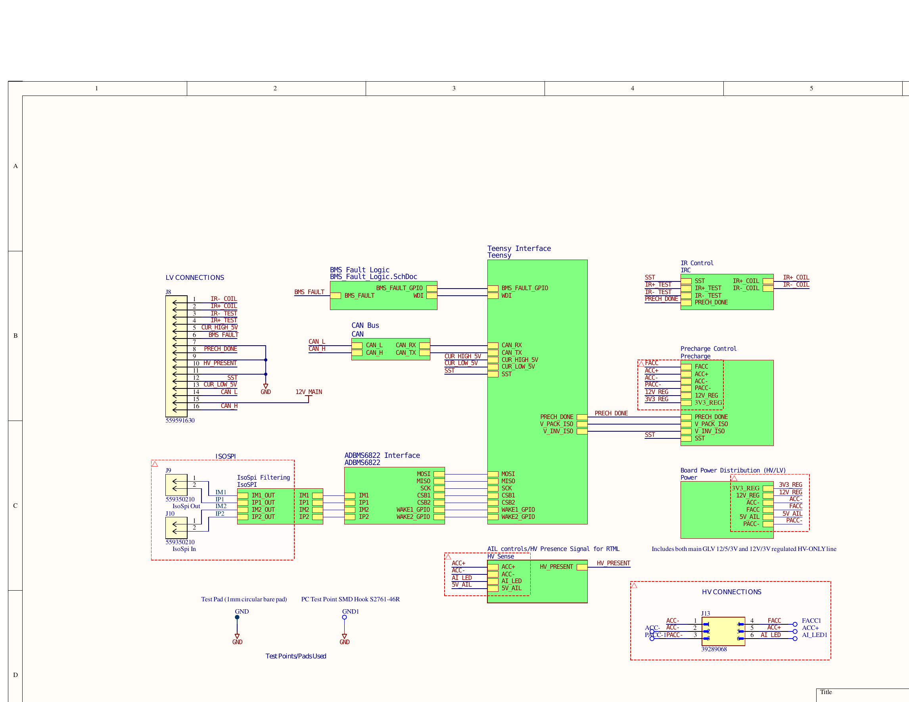
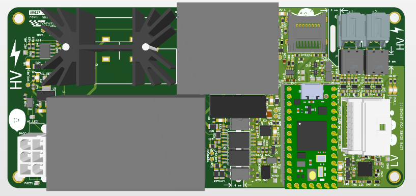
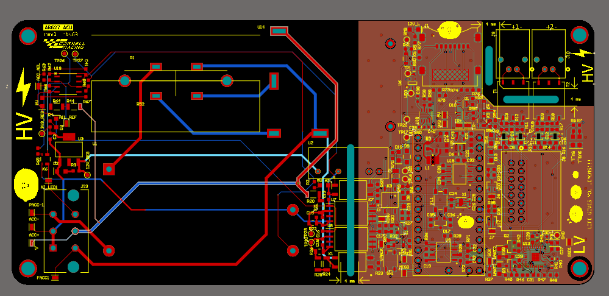
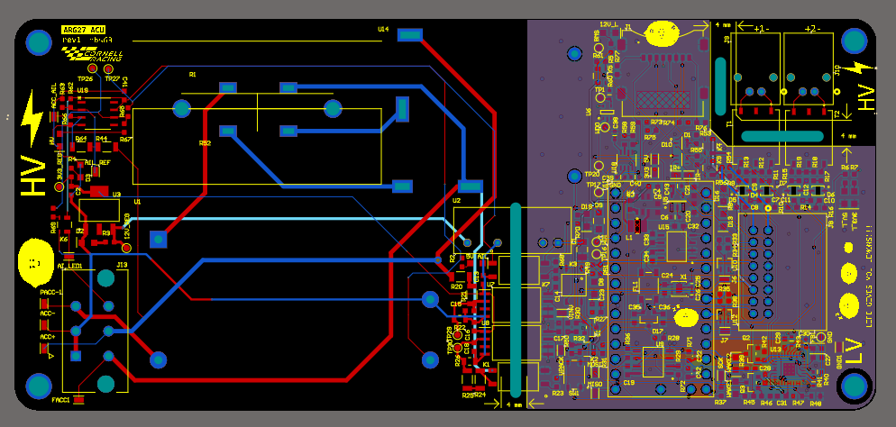
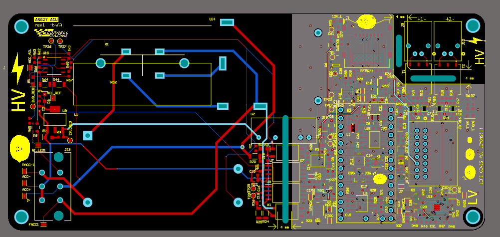

# ARG27 Accumulator Control Unit

An integrated precharge and battery-management control board for Cornell Racing’s electric race car.

  

## Overview

I’m designing the ARG27 Accumulator Control Unit (ACU), which combines the BMS motherboard and precharge control circuitry on one board. It interfaces with the pack’s cell-monitoring boards, controls the precharge sequence, and reports battery data and faults to the rest of the car.

The board uses a **Teensy 4.0** for control and an **ADBMS6822 isoSPI transceiver** to communicate with **ADBMS6830 cell monitors**. It also includes isolated voltage sensing, watchdog-based fault handling, CAN, FRAM for saving state-of-charge estimates, and SD card logging.

The main design challenge is bringing these functions together while maintaining HV/LV isolation and defining how the system responds to faults or loss of control power.

## Hardware

### Battery Monitoring

The Teensy communicates over SPI with the ADBMS6822, which connects to the pack’s cell-monitoring boards through transformer-isolated isoSPI links. The ADBMS6830 devices measure cell voltages on the pack side.

The firmware uses these measurements, along with cell temperatures, to check operating limits and manage balancing during charging.

* [ADBMS6822 interface](assets/ARG27_ACU_Rev1-03adbms6822.png)
* [isoSPI connections](assets/ARG27_ACU_Rev1-IsoSPI.png)
* [Voltage sensing](assets/ARG27_ACU_Rev1-voltagesense.png)
* [Teensy interface](assets/ARG27_ACU_Rev1_teensy_interface.png)

### Fault Handling

The fault output combines the MCU-controlled path with an external watchdog. Both paths must indicate a healthy state for the output to remain high. If either goes low, the output signals a fault to the shutdown board.

This gives the watchdog a way to request shutdown if the firmware stops servicing it.

[BMS fault logic schematic](assets/ARG27_ACU_Rev1-bms%20fault%20logic.png)

### Precharge

The precharge circuit limits current while the tractive bus capacitance charges. Isolated **SI8932D-IS4** sensing circuits measure the voltages before and after the precharge resistor.

The firmware uses these measurements to determine when the bus reaches 90% of the accumulator voltage before completing the relay sequence.

* [Precharge schematic](assets/ARG27_ACU_Rev1-precharge.png)
* [Isolated relay control](assets/ARG27_ACU_Rev1-IsoRelayControl.png)
* [Precharge state machine](assets/precharge%20state%20machine.png)

### HV-Present Indication

The board includes hardwired sensing for the accumulator indicator light (AIL) and HV-present indication. This circuitry senses voltage downstream of the isolation relays and is designed to operate independently of the common LV supply.

Keeping this function independent allows the indication to respond to voltage that remains on the bus even when the main LV supply is unavailable.

[HV sensing schematic](assets/ARG27_ACU_Rev1-HVsense.png)

### Power, Communications, and Storage

Power distribution includes isolated low-voltage supplies for circuitry referenced to the HV domain, along with inrush limiting for the HV sensing supply.

CAN connects the ACU to the vehicle ECU. An SD card provides storage for measurement logs, while FRAM is intended to retain SOC estimates between power cycles.

* [Power distribution schematic](assets/ARG27_ACU_Rev1-power%20distribution.png)
* [CAN interface](assets/ARG27_ACU_Rev1-can.png)

## PCB Layout

The PCB combines the HV-referenced sensing and power circuitry with the LV control electronics. A major layout consideration is maintaining separation between these domains while routing the isolated power, sensing, and communication interfaces.

  

<table>
  <tr>
    <td align="center">
      
       Top
    </td>
    <td align="center">
      
       Bottom
    </td>
  </tr>
</table>

  

[Full PCB layout](assets/ARG27_ACU_Rev1-pcb.png)

## Firmware

The firmware builds on Cornell Racing’s existing custom BMS code and the **LAMBMS** library. My work focuses on integrating the ARG27 hardware, adding SOC estimation, and making the code easier to debug and extend.

The main firmware responsibilities are:

* Read and filter cell voltage and temperature measurements
* Detect voltage, temperature, and open-wire faults
* Control cell balancing during charging
* Manage the precharge sequence
* Send battery data over CAN and record it to the SD card
* Assert the BMS fault output when a shutdown condition is detected

[BMS firmware architecture](assets/Overall%20BMS%20firmware%20hiearchy.png)

### SOC Estimation

I’m developing SOC estimation using pack current and cell voltage measurements, with FRAM storage to preserve the estimate between power cycles.

[SOC implementation diagram](assets/SCO%20estimation%20impelmentation.png)

## Development Background

Cornell Racing moved from an off-the-shelf BMS to a custom design in ARG25. The existing code provides a polling-based architecture, charging functionality, and firmware-based precharge detection.

For ARG27, I’m building on that work with the following priorities:

* Verify CAN communication and core monitoring functionality
* Add SOC estimation and persistent storage
* Complete daisy-chain support and watchdog integration
* Improve fault diagnostics and testing
* Standardize configuration and code structure
* Evaluate whether interrupt-driven scheduling or an RTOS would improve execution timing

## Main Components

| Function                           | Component                    |
| ---------------------------------- | ---------------------------- |
| Control MCU                        | Teensy 4.0 — NXP i.MX RT1062 |
| isoSPI transceiver                 | Analog Devices ADBMS6822     |
| Cell monitoring                    | Analog Devices ADBMS6830     |
| Isolated precharge voltage sensing | SI8932D-IS4                  |
| Persistent SOC storage             | FRAM                         |
| Data logging                       | SD card                      |
| Vehicle communication              | CAN                          |
